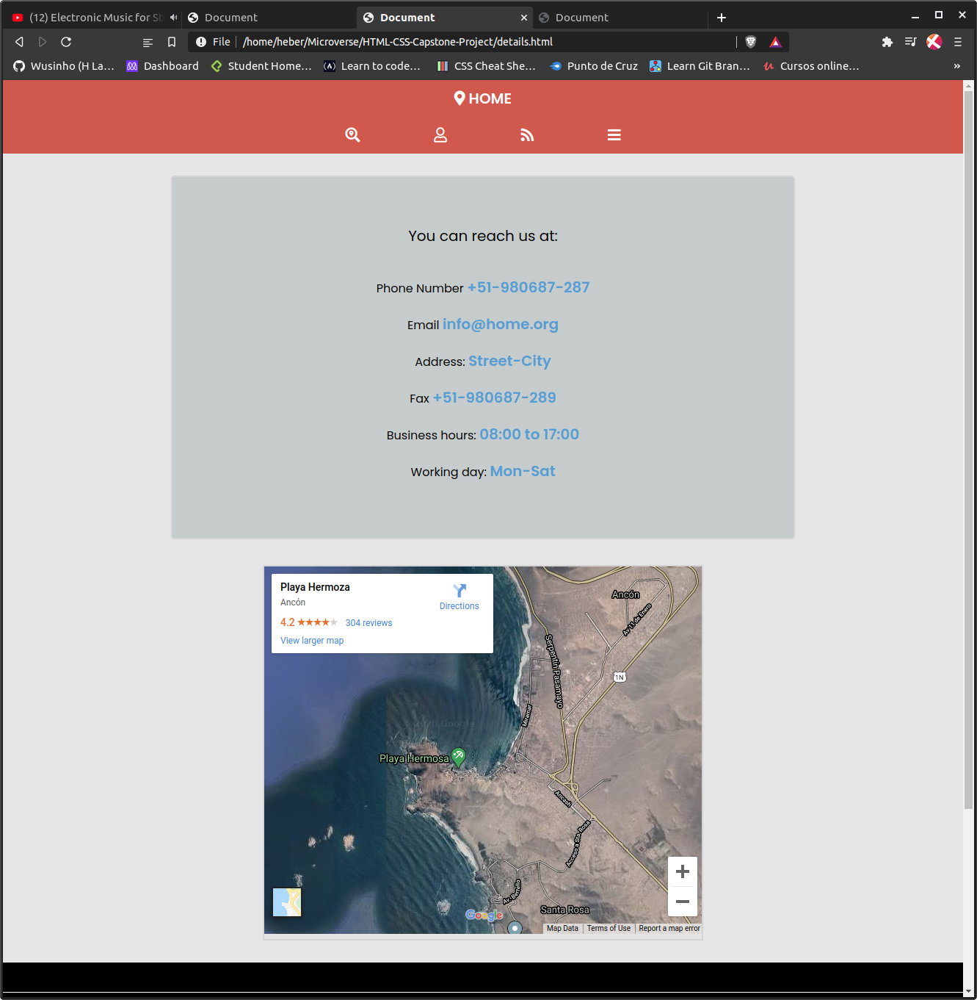

# HTML-CSS-Capstone-Project# directory-of-houses

This is a capstone project for HTML and CSS part of Microverse program.

This project is an online house directory website, which contains 3 pages:

1- Homepage.
2- Search results page.
3- Contact page (details page).

- Each page with 3 responsive breakpoints

## I used:

- HTML5.
- CSS3.
- flexbox.
- Fontawesome.
- CSS animation.
- Bootstrap
- Less (Pre - Processort)

# Home page:

- Box for search.
- 4 cards display How the website workss .
- 3 cards display the most important advantages of using this website.

- ScreenShot for the desktop version of the page:
  

# Search Result page:

- Container for search.
- 3 img slide show will appear.

- ScreenShot for the desktop version of the page:
  

# House's directory web page (details page):

- Location with embedded google map.
- Basic information.

- ScreenShot for the desktop version of the page:
  

## Getting Started

- Open CMD
- write this command: git clone https://github.com/Wusinho/HTML-CSS-Capstone-Project.git
- Open the containing folder then open index.html

## Live Demo

Here you will find a Live Demo page, any comment is well received.

[Live Demo Link](https://wusinho.github.io/HTML-CSS-Capstone-Project/)

## Video Demo

[Video Demo Link] (https://www.loom.com/share/df408daec9f549b2988b28fcb51a3b25)

## Authors

Please feel free to contact me at any time:

👤 **Heber Lazo**

- [@lazo_heber](https://www.linkedin.com/in/heber-lazo-benza-523266133/) [][linkedin]

- [@lazo_heber](https://twitter.com/lazo_heber) [][twitter]

## 🤝 Contributing

Contributions, issues, and feature requests are welcome!

Feel free to check the [issues page](https://github.com/Wusinho/HTML-CSS-Capstone-Project/issues).

## Show your support

Give a ⭐️ if you like this project!
Also, the advice is well received.

## Acknowledgments

- Microverse Team.

## 📝 License

This project is [MIT](LICENSE) licensed.
